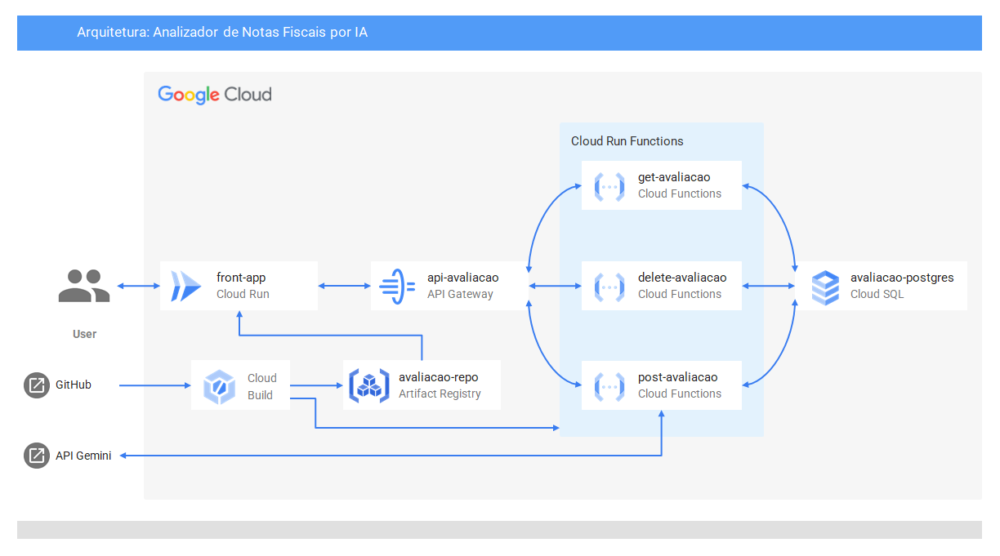

## SEMANA 1: Analizador de documentos via IA
### Objetivo: Integrar API FastAPI com API do Gemini 
**02/07 - 04/07**
- **Backlog Semanal**
    - Obter chave da API Gemini, estudar documentação para futura integração ✅
    - Desenvolver API `FastAPI` em Python com métodos básicos (GET, POST, ...) ✅
    - Integrar upload de imagem à API ✅
    - Integrar API `FastAPI` com a API do Gemini, por meio de requisição via `requests` (python) ✅
    - Desenvolver prompt e formatar retorno do Gemini para um `JSON` padronizado ✅
    - Desenvolver `docker-compose` e rodar a API em um container local ✅
    
    - **Bônus**
      - Instalar dependências relativas à conexão com o Postgres ✅
      - Definir tabela ✅
        - ```mermaid
          erDiagram
          notas {
            serial id
            real valor
            varchar cnpj
            date data
          }
          ```
      - Integrar conexão com o Postgres no método `POST`, salvando os campos extraídos na tabela ✅
      - Integrar conexão com o Postgres no método `GET`, coletando todas as informações da tabela ✅
      - Definir container do banco no docker-compose com volume persistente ✅
      - Integrar container da API com o novo container do banco ✅
      - Adicionar método DELETE na API ✅
      - Refatorar pastas para desenvolvimento do front (front e api em pastas separadas) ✅
      - Iniciar projeto react vazio e instalar dependências ✅
      - Desenvolver tela (componente) ✅
      - Integrar front com API ✅
      - Subir front no docker-compose ✅

- **Resultado Esperado**
    - API desenvolvida em `FastAPI` que envia  um arquivo de uma nota fiscal e retorna o Valor Total, Data de Emissão e CNPJ em um `JSON` padronizado.
      - **02/07** - Em primeiro momento, criei uma chave da API Gemini e defini - com a ajuda do `PyPi` as dependências que necessitaria para a primeira parte do projeto. Com as dependências instaladas em um ambiente virtual `venv`, desenvolvi uma API simples com um único método `GET` que retornava um `Hello World`. A partir dessa API, comecei a desenvolver a aplicação em si, iniciando pelo método `POST`, que inicialmente recebia uma imagem e salvava no meu ambiente local. Vendo que a integração do `POST` com uma imagem funcionava, integrei a chave da API que tinha conseguido anteriormente e comecei fazendo requisições simples ao endpoint do Gemini com o intuito de testes. Com a requisição ao Gemini integrada, desenvolvi o prompt que iria utilizar e formatei o retorno do Gemini em um `JSON` padronizado contendo apenas os campos requiridos (valor, CNPJ e data).
        - **Evolução**: 83%
        - **TODO**: Desenvolver `Dockerfile` e `docker-compose`, integrar com o banco de dados.
      - **03/07** - Em segundo momento, com a API já processando as imagens, trabalhei em subir a mesma em um container Docker. Desenvolvi um `Dockerfile` próprio para a API a partir da imagem padrão `Python` e buildei / rodei localmente. Depois que ela já estava rodando certinho, transportei a mesma ideia para um `docker-compose`, contendo apenas um container por enquanto. Com isso o objetivo definido da semana foi concluído!! E por isso decidi adiantar passos que viriam nas semanas posteriores. Comecei definindo a integração do banco com a API, instalando as dependências e desenvolvendo o método de conexão dentro da API. Com isso, desenvolvi a `query` que criaria a tabela e em seguida defini a lógica de inserção de dados na tabela via python. Parti da mesma lógica para o desenvolvimento da função `GET` também. Para realizar os testes, modifiquei para o `docker-compose` agora subir dois containeres: a API e o banco Postgres. Depois de alguns testes, consegui integrar os dois containeres e fazer com que o container do banco persistisse os dados, mesmo após seu desligamento!!
        - **Evolução**: 100% + **Integração com o banco**: 100%
        - **TODO**: Desenvolver um front-end para envio das imagens.
      - **04/07** - Inicialmente fiz algumas correções relativas ao retorno do método `GET`, que antes retornava uma lista com várias tuplas, e agora retorna um `JSON` padronizado para o cliente. Também melhorei o tratamento de exceções, principalmente na função `POST`, para caso houvesse algum erro no processamento da imagem. Para deixar a API mais completa, também criei um método `DELETE`, que deleta uma linha da tabela de acordo com um `id` passado como parâmetro. Com essas alterações, parti para o início do desenvolvimento do front-end. De início, refatorei a API movendo ela para uma pasta separada e criei uma outra pasta para o front-end. Nela, iniciei um projeto `react` com template `typescript` e adicionei o `tailwind` para futura estlização. Criei um componente básico com botão de seleção de arquivo, botão de envio e um espaço para exibir as informações de retorno da chamada da API. Habilitei o `CORS` na API para que o front conseguisse se comunicar e, depois de testar e ver que eles estavam conseguindo se enxergar, criei um `Dockerfile` específico para o front a partir da imagem `node` e adicionei seu container no `docker-compose` (que antes só tinha a API e o banco de dados)!
        - **Evolução**: 100% + **Integração com o banco**: 100% + **Integração com front**: 100%
        - **TODO**: Subir aplicação no GCP

- **Dúvidas do Aluno/Impedimentos Encontrados**
    - \<DÚVIDAS\>

- **Questões para o Aluno**
    - \<QUESTÕES\>

- **Respostas das Questões**
    - \<RESPOSTAS\>

## SEMANA 2: Analizador de documentos via IA
### Objetivo: Refatorar aplicação para subir no GCP
**07/07 - 11/07**
- **Backlog Semanal**
    - Estudar e definir serviços a serem utilizados para hospedar a API / banco de dados ✅
    - Refatorar função `server.py` em funções separadas para cada tipo de requisição ✅
    - Fazer funções separadas rodarem no `Cloud Run Functions` ✅
    - Instanciar banco de dados `postgres` no `Cloud SQL` ✅
    - Comunicar funções `Cloud Run Functions` com banco de dados no `Cloud SQL` ✅
    - Instanciar API no `API Gateway` ✅
    - Linkar rotas da API com as novas funções ✅
    - Aprimorar front (implementar `GET` e `DELETE` além do `POST`) ✅
    - Estudar e definir serviços com o fito de hospedar o frontend da aplicação ✅
    - Refatorar o front para compatibilidade com o `GCP` (se necessário) ✅
    - Integrar front no `GCP` com a API no `API Gateway` ✅
    - Documentar arquitetura (Desenhar diagrama) ✅

- **Resultado Esperado**
    - A aplicação (API previamente desenvolvida) rodando numa arquitetura otimizada utilizando serviços do Google Cloud Platform (`GCP`).
      - **07/07**:
        - Defini a arquitetura a ser utilizada pra hospedar o back-end no `GCP`, consistindo do fluxo:
          - `Usuário <-> API Gateway <-> Cloud Run Functions <-> Cloud SQL`
        - Refatorei a API (previamente rodando com `Fast API`) para puramente consultar o banco e retornar os valores, ou seja, retirando a necessidade e a dependência do `Fast API`
        - Instanciei um banco de dados `Postgres` no `Cloud SQL`
            
        - Integrei as minhas funções com o novo banco
            
            
        - Instanciei uma nova API no serviço `API Gateway` (onde o usuário vai acessar a URL pública)
        - Defini o arquivo `yaml` de configuração da API, linkando os métodos e rotas com as funções que desenvolvi previamente no `Cloud Run Functions`.
            
      - Evolução: 60%

    - **08/07**:
      - De início, modifiquei o frontend para ter uma navbar superior e conseguir navegar entre as páginas de:
        - Visualização de notas;
        - Envio de notas para processamento (já tinha);
        - Excluir linhas da tabela.
      - Em seguida desenvolvi as telas de visualização e excluir, integrando elas com, respectivamente, os métodos `GET` e `DELETE` que já tinham sido desenvolvidos na API
      - Depois, estudando diferentes serviços para fazer a implementação do front no `GCP` defini o `Cloud Run` para o rodar a imagem `Docker` que já tinha desenvolvido
      - Pra isso, estudei como fazia uma implementação `CI/CD` com o GitHub, onde cada vez que eu faço um commit, o GitHub automaticamente builda a imagem, sobe num repositório de imagens do `GCP` (`Artifact Registry`) e atualiza o container rodando no `Cloud Run` com a versão mais atualizada da imagem!!
        - Criei o repositório no `Artifact Registry`
             
        - Criei uma conta de serviço com permissões para acessar o `Artifact Registry` e o `Cloud Run`
             
        - Resgatei as credenciais dessa conta e salvei como variáveis de ambiente no repositório do GitHub
        - Desenvolvi o arquivo `yml` que executa os passos necessários para o deploy após cada commit
      - Para isso, tive que configurar a API para aceitar `CORS` (requisições advindas da nova URL pública do `Cloud Run`) e o deploy `CI/CD` integrado com o `GCP` funcionou normalmente!
      - Evolução: 100%

    - **10/07**:
      - Estudei o padrão de diagramas de arquiteturas GCP
      - Desenhei o diagrama da arquitetura serverless que estou utilizando para a análise de images
      - Aprimorei o front-end, adicionando um placeholder de loading enquanto o front faz a requisição para a API
      - Evolução: 100%

     

- **Dúvidas do Aluno/Impedimentos Encontrados**
    - \<DÚVIDAS\>

- **Questões para o Aluno**
    - \<QUESTÕES\>

- **Respostas das Questões**
    - \<RESPOSTAS\>

## SEMANA 3: \<NOME DO PROJETO\>
### Objetivo: \<OBJETIVO DA SEMANA\>
**14/07 - 17/07**
- **Backlog Semanal**
    - \<QUEBRAR O OBJETIVO DA SEMANA EM PARTES MENORES\>

- **Resultado Esperado**
    - \<QUAL ENTREGÁVEL SERÁ PRODUZIDO QUANDO O OBJETIVO FOR ALCANÇADO (FINAL DA SEMANA)\>
    - Evolução: \<0% - 100%\>

- **Dúvidas do Aluno/Impedimentos Encontrados**
    - \<DÚVIDAS\>

- **Questões para o Aluno**
    - \<QUESTÕES\>

- **Respostas das Questões**
    - \<RESPOSTAS\>
---
## Descrição do Projeto
Criar uma API em Python, usando FastAPI, que receba uma imagem (.jpg, .jpeg, .png) ou um PDF de uma Nota Fiscal; salve o Valor Total, Data de Emissão e CNPJ no banco de dados Postgres e retorne os mesmos campos em formato json.

A API e o banco de dados devem rodar localmente em docker e o projeto como um todo deve poder ser iniciado usando o "docker compose". Também é necessário que os dados persistam mesmo que os dockers sejam pausados ou desligados.

O ambiente local deve estar num ambiente virtual, criado com o "venv", e os pacotes devem estar listados no arquivo "requirements.txt".

## Stack
- Python
- Postgres
- FastAPI
- Docker
    - Dockerfile
    - Docker compose
- Gemini
    - API

## Referências
- Python
    - https://www.python.org/downloads/
    - https://www.python.org/doc/
- Repositório de pacotes python
    - https://pypi.org/
- Ambiente virtual
    - https://docs.python.org/pt-br/3/library/venv.html
- Docker
    - Dockerfile, build de imagem e rodar container: https://docs.docker.com/build/concepts/dockerfile/
    - Docker compose: https://docs.docker.com/compose/
- FastAPI
    - https://fastapi.tiangolo.com/tutorial/
    - https://fastapi.tiangolo.com/tutorial/first-steps/#step-4-define-the-path-operation-function
    - https://pypi.org/project/fastapi/
    - https://www.youtube.com/watch?v=7eCdONqaHDc
- Banco de dados
    - https://www.postgresql.org/
    - https://pypi.org/project/SQLAlchemy/
    - https://pypi.org/project/psycopg/
    - https://www.postgresql.org/docs/current/datatype.html
    - https://www.psycopg.org/docs/usage.html#passing-parameters-to-sql-queries
    - https://stackoverflow.com/questions/26496388/how-to-connect-python-to-postgresql
- Gemini
    - https://aistudio.google.com/apikey
- Frontend
    - https://v3.tailwindcss.com/docs/guides/create-react-app

## Passo a Passo do Projeto
1. Fazer o setup do ambiente
    - criar repositório
    - instalar dependências
    - instalar docker
1. Criar api do projeto com o FastAPI
1. Fazer a extração de campos com Gemini
1. Adicionar integração com banco de dados

## Benchmarks
- Semana 1
    - setup inicial: repositório, pacotes, docker
    - testar fastapi
    - testar gemini
- Semana 2
    - desenvolver api para fazer extração de campos
- Semana 3
    - integrar com banco de dados
    - finalizar documentação
    - apresentação final

## Diretivas
- **Reuniões**  
    **07/07 (segunda)** - report de progresso e impedimentos  
    **10/07 (quinta)** - report de progresso e impedimentos  
    **15/07 (terça)** - report de progresso e impedimentos  
    **17/07 (quinta, apresentação final)** - apresentação do resultado final  
- Documentar código e processos durante todo o projeto  
- Fazer update diário do relatório  
- Fazer update diário do código  
- O repositório deve ter um nome padrão: \<NOME DO ALUNO\>-AVALIAÇÃO

## Avaliação
- Evolução técnica com base nos resultados semanais
- Autonomia no desenvolvimento e impedimentos
- Organização (repositório, report, documentação, git)